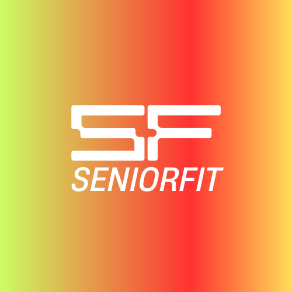

# 🏋️‍♂️ SeniorFit - Gimnasio para Adultos Mayores



## 👋 ¡Hola! 

Este es mi proyecto **SeniorFit**, una plataforma web dedicada al bienestar y fitness para adultos mayores. 

## 🎯 ¿De qué se trata el proyecto?

SeniorFit es es una plataforma pensada específicamente para adultos mayores que buscan:

- **Mantenerse activos** con rutinas adaptadas a sus necesidades
- **Formar parte de una comunidad** que entiende sus objetivos de bienestar
- **Acceder fácilmente** a información sobre planes, sedes y contacto
- **Inspirarse** con contenido motivacional y educativo sobre los beneficios del ejercicio

El sitio cuenta con:
- 🏠 **Home**: Página principal con información motivacional y beneficios del ejercicio
- 📋 **Planes**: Diferentes opciones de membresía
- 📍 **Sedes**: Ubicaciones disponibles
- 👥 **Comunidad**: Espacio para conectar con otros miembros
- 📞 **Contacto**: Formulario y información de contacto

## 🛠️ Tecnologías que utilicé

### Frontend
- **HTML5** - Estructura semántica y accesible
- **CSS3** - Estilos personalizados y responsive design
- **SCSS/Sass** - Preprocesador CSS para mejor organización
- **Bootstrap 5.3.2** - Framework CSS para componentes y grid system

### Herramientas de desarrollo
- **Sass compiler** - Para compilar archivos SCSS a CSS
- **Git** - Control de versiones
- **VS Code** - Editor de código

## 🔧 Cómo aproveché cada herramienta

### HTML5
Implementé una estructura semántica clara utilizando:
- Etiquetas semánticas (`<header>`, `<main>`, `<section>`, `<footer>`)
- Meta etiquetas para SEO (description, keywords)
- Atributos de accesibilidad (alt, aria-labels)
- Favicon personalizado para la identidad de marca

### CSS3 & SCSS
Organicé el código CSS de manera escalable:
```
scss/
├── style.scss (archivo principal)
├── components/ (componentes reutilizables)
├── layout/ (estructura de la página)
└── var/ (variables globales)
```

Aproveché las características de SCSS como:
- **Variables** para colores, fuentes y espaciados consistentes
- **Mixins** para código reutilizable
- **Nesting** para mejor organización
- **Partials** para modularidad

### Bootstrap 5
Integré Bootstrap estratégicamente para:
- **Sistema de Grid** responsive (col-lg, col-md, col-sm)
- **Navbar** con menú hamburguesa para móviles
- **Container-fluid** para layouts flexibles
- **Clases utilitarias** combinadas con estilos personalizados

## 🔗 Cómo conecté las tecnologías

### 1. Arquitectura CSS modular
Creé una arquitectura SCSS bien estructurada que se compila a un solo archivo CSS:
- **Variables globales** definidas en `var/variables.scss`
- **Reset** y **grid** en la carpeta `layout/`
- **Componentes** reutilizables (cartas, formularios, iconos)
- **Media queries** organizadas por dispositivo

### 2. Integración Bootstrap + CSS personalizado
No reemplacé todo con Bootstrap, sino que lo combiné inteligentemente:
- Usé el **grid system** de Bootstrap para estructura responsive
- Mantuve **estilos personalizados** para la identidad visual única
- Aproveché **componentes** como navbar pero con estilos propios

### 3. Optimización de assets
- **Favicon** optimizado para diferentes dispositivos
- **Imágenes** organizadas en carpeta `medios/`
- **Fuentes personalizadas** (Bebas Neue, fFinish) para identidad visual
- **Video embebido** de YouTube para contenido educativo

### 4. Experiencia de usuario cohesiva
- **Navegación intuitiva** entre páginas
- **WhatsApp link** para contacto directo
- **Scroll suave** con anclas internas
- **Responsive design** que funciona en todos los dispositivos

## 🚀 Características destacadas

- ✅ **Diseño responsive** que se adapta a móviles, tablets y desktop
- ✅ **SEO optimizado** con meta etiquetas apropiadas
- ✅ **Accesibilidad** considerada en toda la experiencia
- ✅ **Performance** optimizada con assets comprimidos
- ✅ **Código limpio** y bien organizado siguiendo mejores prácticas

## 📱 Vista previa

El sitio es completamente responsive y ofrece una experiencia óptima en:
- 📱 **Móviles** (320px+)
- 📲 **Tablets** (768px+)
- 💻 **Desktop** (1024px+)

## 🎨 Paleta de colores y tipografía

- **Tipografías**: Bebas Neue para títulos, fFinish para textos
- **Colores**: Paleta cálida y accesible pensada para adultos mayores
- **Espaciado**: Generoso para facilitar la lectura y navegación

---

